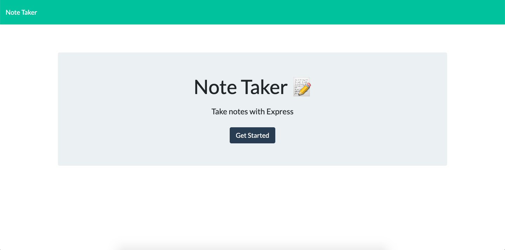
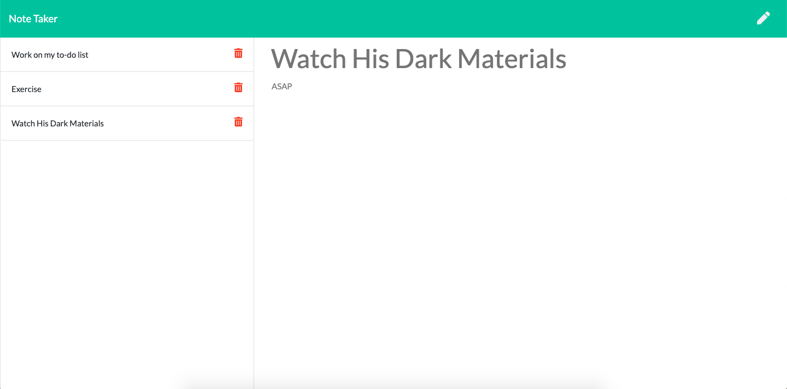

# unit-eleven-homework

Notetaking App

This is a basic notetaking app that allows the user to write new notes with a header and body text, as well as delete those notes upon completion.

Link to github:
[https://github.com/BestBroBradley/unit-eleven-homework](https://github.com/BestBroBradley/unit-eleven-homework)

Link to heroku:

# Functionality:

Upon first loading the page, the user is taken to a landing page briefly describing the app, from which they can access the notes pages.

There are three primary functions in this app.  The first is the ability see the user's previous notes along the left side of the page.  If the user clicks on these notes, the information for that note will appear in the main area on the righthand side.

The user also has the option to add new notes by clicking on each of the two buttons at the top of the page.

Additionally, by clicking the delete button next to each note, the user can remove that note.

Landing page:

Notetaking page:

# Third party items used:

Bootstrap:
[https://www.bootstrapcdn.com/](https://www.bootstrapcdn.com/)

jQuery:
[https://jquery.com/](https://jquery.com/)

Express:
[https://www.npmjs.com/package/express](https://www.npmjs.com/package/express)